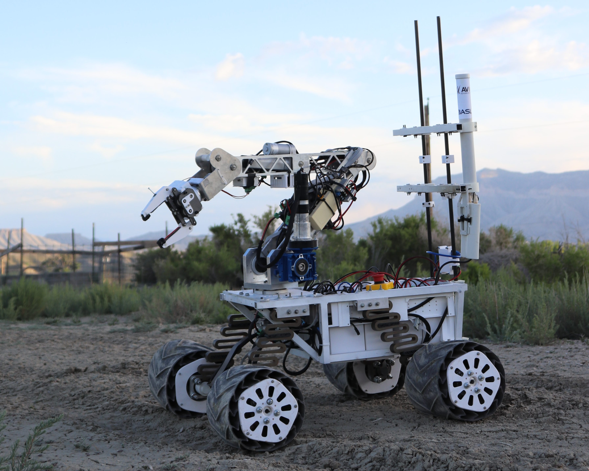
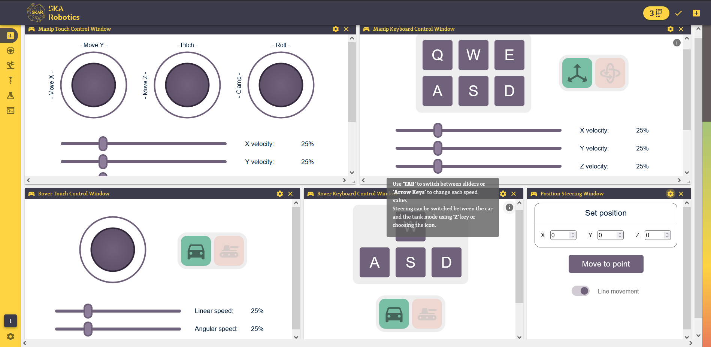
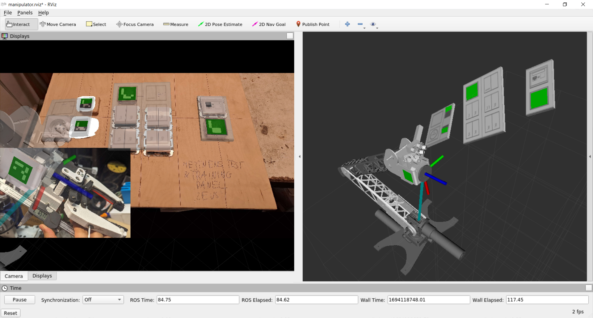

# Sirius II - participantion

This document shortly describes my participation in the project of the Martian Rover realized by Students Space Association (SKA) at WUT. The main repository with the software of our rover is linked [*here*](https://github.com/SKA-Robotics/rover-soft).

## Photo of our rover - Sirius II

## Used technologies

- Ubuntu 20.04
- ROS (Robot Operating System)
- Python 3
- Vue 2 + Vuetify
- JavaScript
- HTML + CSS

## My contribution to the project

- Code for steering the rover and the manipulator (robotic arm) by XBOX joystick (last changes linked [*here*](https://github.com/SKA-Robotics/rover-soft/tree/1474af06fd8fc2d3b03b5321879cafd9310efdd9))
- Module of the web interface to visualize various ROS data streams on the charts (branch linked [*here*](https://github.com/SKA-Robotics/rover-soft/tree/24-wyswietlanie-danych-na-wykresach))
- Module of the web interface to control the rover and the manipulator (branch linked [*here*](https://github.com/SKA-Robotics/rover-soft/tree/25-okno-do-sterowania-poprzez-interfejs))
- Locating the control panel by Aruco tags recognition and viualization of it in Rviz (last tested commit linked [*here*](https://github.com/SKA-Robotics/rover-soft/tree/5373d2d2f4f21ceb3a26670433a89dabb1714868))
- Algorithm for optimizing inverse kinematics solver (branch linked [*here*](https://github.com/SKA-Robotics/rover-soft/tree/30-ik-optimization))

## Presentation

### Steering panel in the web interface

### Visualization of the control panel in Rviz

